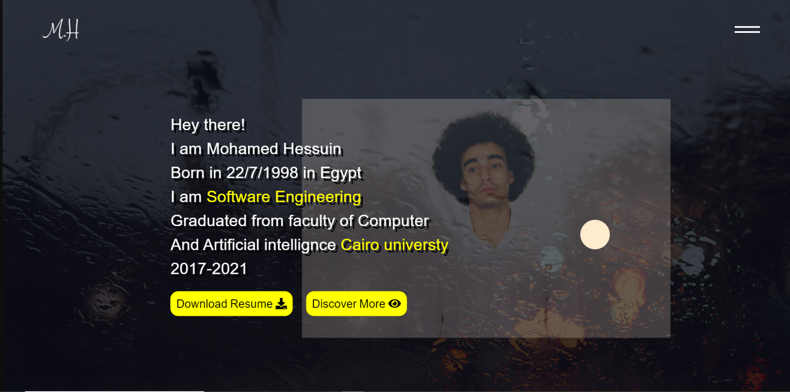

# MyResume

it breifly show my skills and informations about myself 

# Projec Aim

1-training on how to design site from scratch without external desingersI

2-applying on modern web animations that triggle based on scroll like sites that desplay on https://www.awwwards.com/

3-applying on Scroll-magic for animation based on scroll

4-applying on GSAP for smooth animation

5-applying on Barba.js for transition between pages

# Site url

https://mohamedhessuin.netlify.app/

